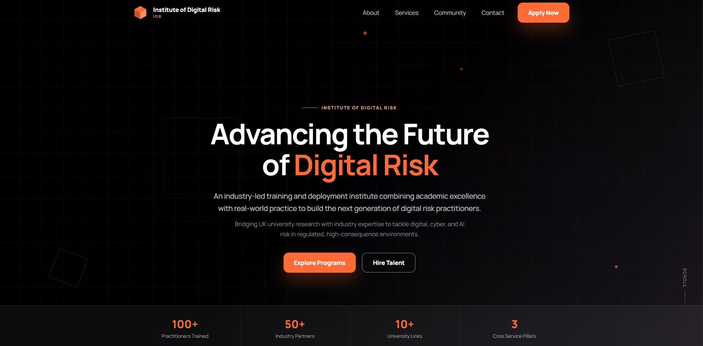

# Institute of Digital Risk (IDR) – Website

A modern, responsive website designed for the **Institute of Digital Risk (IDR)**.  
This project focuses on building a strong brand identity and a clean digital experience that communicates the institute’s vision of advancing professionals in **digital, cyber, and AI risk management**.

---

## 🚀 Live Demo

👉 https://adityakumar747.github.io/IDR-Digital/

---

## 🚀 Overview

This website delivers a professional and accessible platform to showcase IDR’s mission, services, and ecosystem. It combines structured content, modern UI design, and responsive layout techniques to ensure a seamless user experience across devices.

---

## 🎯 Project Highlights

- Designed a clean and professional corporate UI  
- Built a fully responsive layout for all screen sizes  
- Implemented smooth scrolling and interactive elements  
- Created a scalable brand identity and logo system  
- Focused on accessibility and readability  

---

## 🎨 Brand & Logo Design

The IDR logo is based on a **cube-inspired geometric concept**, representing:

- Structured systems  
- Layered digital risk  
- Stability in complex environments  

### Design Elements

- **Orange Accent** – Innovation, energy, forward momentum  
- **Black & White Base** – Clean, professional, high contrast  
- **Modern Typography** – Minimal and credible  

### Logo Variants

- Icon-only version  
- Icon with full institute name  

The logo is optimized for:
- Favicons  
- Mobile headers  
- Scalable digital use  

---

## ✨ Features

- Modern and responsive UI/UX  
- Sticky navigation bar  
- Smooth scrolling navigation  
- Accessible color contrast  
- Interactive hover states  
- Animated hero section background  
- Clean and structured layout  

---

## 🧩 Website Sections

### 🏠 Hero Section
- Headline: *Advancing the Future of Digital Risk*  
- Clear value proposition  
- Call-to-action buttons  

---

### ℹ️ About IDR
- Overview of the institute  
- Academic and industry collaboration  

---

### 🏢 Core Pillars

- **Academy**  
  Training programs and bootcamps  

- **Innovation & Incubation**  
  AI governance and digital risk models  

- **Advisory Services**  
  Framework implementation including:
  - NIST  
  - ISO 27001  
  - NIS2  

---

### 🌐 Community
- Students and early-career professionals  
- Upskilling in cyber and digital risk  

---

### 📩 Contact / Registration
- Simple form to capture user interest  
- Clean and intuitive UI  

---

## 📸 Screenshots

### 🏠 Homepage

---

## 🛠 Tech Stack

- HTML5  
- CSS3  
- JavaScript  
- Flexbox  
- Google Fonts  

---

## 📂 Project Structure

idr-website/
├── index.html
├── style.css
├── script.js
├── assets/
│   └── logo.png
├── screenshots/
│   ├── homepage.png
│   └── section.png
└── README.md

---

## ⚙️ Setup & Usage

1. Clone the repository

git clone https://github.com/your-username/idr-website.git  
cd idr-website  

2. Open `index.html` in your browser

---

## 🤝 Contributing

Contributions are welcome.

- Fork the repository  
- Create a new branch (feature/your-feature)  
- Commit your changes  
- Open a Pull Request  

---

## 🐞 Feedback & Improvements

If you find any issues or have suggestions:

- Open an issue  
- Provide clear details and steps to reproduce  

---

## 📄 License

This project is licensed under the MIT License.

---

## ⭐ Support

If you found this project helpful, consider giving it a ⭐ on GitHub.

---

## 👨‍💻 Author

Aditya Kumar  
Frontend Developer | Web Development Enthusiast  

GitHub: https://github.com/Adityakumar747
